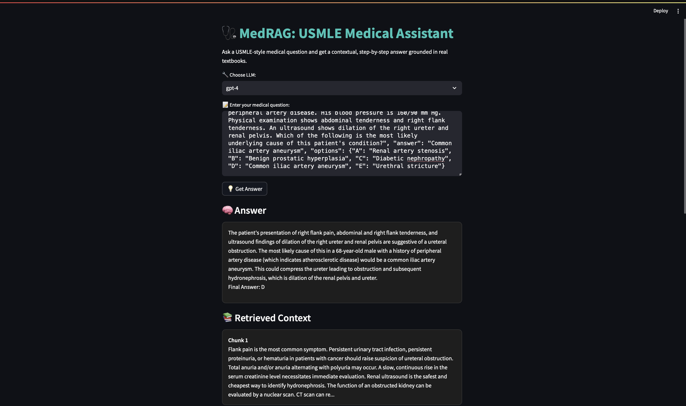

# 🩺 MedRAG-GPT: Medical Q&A with Retrieval-Augmented Generation

**MedRAG-GPT** is a Retrieval-Augmented Generation (RAG) pipeline designed to enhance accuracy on medical Q&A datasets like MedQA by grounding GPT-4 responses in relevant context. It’s built for use in clinical education, USMLE prep, and AI-assisted diagnosis support.

---

## 🎯 Highlights

- 🚀 Boosted MedQA accuracy to **70%** using GPT-4 + RAG (vs 58% without RAG)
- 🔍 Uses HuggingFace embeddings + ChromaDB for high-recall document retrieval
- 🎨 Clean, intuitive **Streamlit UI** with source document traceability
- ⚙️ Modular pipeline for RAG, evaluation, and deployment

---
